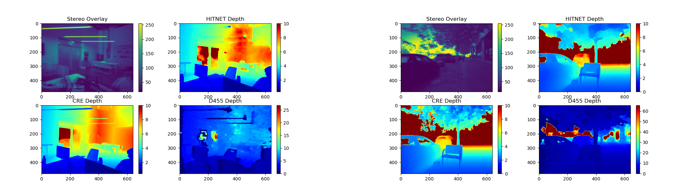

# Depth Estimation Project
This repository contains the work for my Bachelor of Science (B.Sc.) degree in Mechanical Engineering at Ben-Gurion University of the Negev. The project focuses on developing and evaluating algorithms for depth estimation using stereo cameras integrated with ROS2.

The system leverages advanced computer vision techniques and neural networks to estimate depth from stereo camera inputs, offering valuable insights for applications in robotics and autonomous systems. This repository includes detailed instructions for setting up the project environment using Docker to ensure compatibility and ease of deployment.

The Project's Report can be found in [documents](documents/).

<!--


-->

<div style="display: flex; flex-direction: column; align-items: center; width: 100%;">

  <!-- Images displayed side by side -->
  <div style="display: flex; justify-content: space-between; width: 100%;">
    <div style="width: 45%;">
      
    </div>
    <div style="width: 45%;">
      
    </div>
  </div>

  <!-- Single caption centered below both images -->
  <div style="width: 100%; text-align: center; margin-top: 10px;">
    <p style="width: 100%; text-align: center;">
      <strong>Indoor Visual Comparison (Left Side) and Outdoor Visual Comparison (Right Side)</strong>
    </p>
  </div>

</div>


## Table of Contents
- [Requirements for Project Setup](#requirements-for-project-setup)
  - [NVIDIA Container Runtime](#nvidia-container-runtime)
  - [CUDA Toolkit](#cuda-toolkit)
  - [cuDNN](#cudnn)
  - [Docker](#docker)
  - [ROS Wrapper for Intel® RealSense™ cameras](#ros-wrapper-for-intel-realsense-cameras)
  - [Additional Requirements](#additional-requirements)
  - [ONNX Runtime](#onnx-runtime)
- [Post-Installation Instructions](#post-installation-instructions)
  - [Enable NVIDIA Runtime After Reboot](#enable-nvidia-runtime-after-reboot)
  - [To Use NVIDIA Runtime](#to-use-nvidia-runtime)
    - [Check `daemon.json`](#check-daemonjson)
    - [Check `config.toml`](#check-configtoml)
    - [Reload and Restart Docker](#reload-and-restart-docker)
  - [Startup Command Execution](#startup-command-execution)
- [Instructions for Using the Containers](#instructions-for-using-the-containers)
  - [Communication](#communication)
  - [Camera Initialization](#camera-initialization)
  - [Stereo Triangulation](#stereo-triangulation)
  - [Neural Networks Depth Estimation](#neural-networks-depth-estimation)
  - [Recording Topics](#recording-topics)
  - [Depth Evaluation](#depth-evaluation)
- [Common Errors](#common-errors)
- [Credits](#credits)

## Requirements for Project Setup:

### NVIDIA Container Runtime:

Ensure you have the NVIDIA container runtime installed to enable GPU acceleration in Docker containers.  
Install guide: [NVIDIA Container Toolkit](https://docs.nvidia.com/datacenter/cloud-native/container-toolkit/latest/install-guide.html)

### CUDA Toolkit:

CUDA is required for GPU computing with your neural network models.  
Download and install from: [NVIDIA CUDA Toolkit](https://developer.nvidia.com/cuda-toolkit)

### cuDNN:

CUDA Deep Neural Network library (cuDNN) is required for accelerating deep learning networks.  
Download and install from: [NVIDIA cuDNN](https://developer.nvidia.com/cudnn)

#### for whole Nvidia CUDA guide follow the instruction from: [NVIDIA CUDA Installation Guide for Linux](https://docs.nvidia.com/cuda/cuda-installation-guide-linux/)


### Docker:

Install Docker to run your containerized application.  
Installation guide: [Docker Installation](https://docs.docker.com/engine/install/ubuntu/)

### ROS Wrapper for Intel® RealSense™ cameras:

To use Intel RealSense cameras with ROS, install the necessary ROS package for your version.  
Installation guide: [Intel® RealSense™ ROS Wrapper](https://dev.intelrealsense.com/docs/ros2-wrapper)

### Additional Requirements:

```bash
git clone https://github.com/RazTurgeman97/depth-estimation-project.git
cd depth-estimation-project
pip install -r requirements.txt
```

#### ONNX Runtime

For Nvidia GPU computers: ```pip install onnxruntime-gpu```

Otherwise: ```pip install onnxruntime```


# Post-Installation Instructions:

## Enable nvidia runtime after reboot:

**If you already did the instruction below** and for some reason you don't want to create a custom systemd service, you can just run the following commands and you are good to go.

```bash
sudo systemctl stop docker.socket

sudo systemctl start docker

docker info | grep -i runtime
```

## To use nvidia runtime:

### make sure that daemon.json contains the following:

```bash
{
    "default-runtime": "nvidia",
    "runtimes": {
        "nvidia": {
            "args": [],
            "path": "/usr/bin/nvidia-container-runtime"
        }
    }
}
```

by running that command:

```bash
cat /etc/docker/daemon.json
```

if the file needs to be edited you can use nano editor or gedit:

```bash
sudo nano /etc/docker/daemon.json
```

```bash
sudo gedit /etc/docker/daemon.json
```

### make sure that config.toml contains the following:

```bash
#accept-nvidia-visible-devices-as-volume-mounts = false
#accept-nvidia-visible-devices-envvar-when-unprivileged = true
disable-require = false
#swarm-resource = "DOCKER_RESOURCE_GPU"
switchover-file = "/etc/nvidia-container-runtime/switch-over"

[nvidia-container-cli]
#debug = "/var/log/nvidia-container-toolkit.log"
environment = []
ldcache = "/etc/ld.so.cache"
ldconfig = "@/sbin/ldconfig"
load-kmods = true
no-cgroups = false
#path = "/usr/bin/nvidia-container-cli"
#root = "/run/nvidia/driver"
user = "root:video"

[nvidia-container-runtime]
debug = "/var/log/nvidia-container-runtime.log"
log-level = "info"
mode = "auto"

[nvidia-container-runtime.modes]

[nvidia-container-runtime.modes.csv]
mount-spec-path = "/etc/nvidia-container-runtime/host-files-for-container.d"

```

if the file needs to be edited you can use nano editor or gedit:

```bash
sudo nano /etc/nvidia-container-runtime/config.toml
```

```bash
sudo gedit /etc/nvidia-container-runtime/config.toml
```

### Reload and restart Docker after editing :

```bash
sudo systemctl daemon-reload
sudo systemctl restart docker
```

### Check Docker info:


```bash
sudo docker info | grep -i runtime
```

## Startup command execution

to make sure you are good to go without any command to perform you can create a custom systemd service to execute these commands automatically on system reboot.

#### 1. Create a new systemd service file:

```bash
sudo nano /etc/systemd/system/docker-nvidia-runtime.service
```
Add the following content to the file:

```ini

[Unit]
Description=Restart Docker with NVIDIA runtime
After=network.target docker.service

[Service]
Type=oneshot
ExecStart=/bin/bash -c 'systemctl stop docker && systemctl stop docker.socket && systemctl start docker && systemctl restart docker'

[Install]
WantedBy=multi-user.target
```
Save and close the file (press Ctrl + X, then Y, then Enter).

#### 2. Reload the systemd daemon to recognize the new service:

```bash
sudo systemctl daemon-reload
```

#### 3. Enable the service to start on boot:

```bash
sudo systemctl enable docker-nvidia-runtime.service
```

Start the service to verify it works:

```bash
sudo systemctl start docker-nvidia-runtime.service
```

Check the status of the service to ensure it's running correctly:

```bash
sudo systemctl status docker-nvidia-runtime.service
```

This custom systemd service will ensure that your Docker runtime is configured with NVIDIA support every time your system reboots.

### Reboot and Verify

Reboot your system:

```bash
sudo reboot
```

After rebooting, check Docker runtime settings again:

```bash
docker info | grep -i runtime
```

# Instructions for Using the Containers

## Communication:

Each Docker container used in this project is pre-configured with all necessary dependencies, including ROS2 and neural network packages. No additional installations are required.

The containers are set up to use **ROS domain ID 97**, which allows communication between nodes over a shared network. Additionally, the **Cyclone DDS** middleware is configured to be the default ROS 2 DDS implementation. The container environment is also configured to work with the provided `cyclonedds.xml` configuration file for DDS communication settings.

To bridge data access between the Docker container and the host machine (for example, for large recordings), the following volume is mounted using the following line in the devcontainer.json file:

```bash
--volume=/home/student/ros2_ws:/mnt/data
```
**Note:** Replace "student" with your actual username or replace the whole path to the actual path of your ros2 workspace.

## Camera Initialization:

The camera initialization container is responsible for launching and configuring the Intel RealSense D455 camera. By default, it is set to launch the camera with a resolution of 640x480 at 30 FPS. If desired, you can modify these settings by editing the custom_config.yaml file.

Default launch settings: Uses the predefined settings in the custom_config.yaml using the command:

```bash
ros2 launch realsense2_camera rs_launch_get_params_from_yaml.py config_file:="//workspaces/depth-estimation-project/camera_initialization/src/config/custom_config.yaml"
```

to use default launch: ```ros2 run realsense2_camera realsense2_camera_node```

Customization: You can change the resolution or frame rate by modifying the custom config file at the provided path: ```camera_initialization/src/config/custom_config.yaml```.

## Stereo Triangulation:

The stereo triangulation container handles sparse depth estimation using a stereo camera setup. All node settings can be adjusted as needed, Feel free to adjust the node as you desire.

To run the stereo triangulation node:

```bash
ros2 run stereo_triangulation triangulation_node.py
```

## Neural Networks Depth Estimation:

This container applies both CRE and HITNET neural networks for depth estimation. The node supports automatic frame detection and calibration. Both models are applied by default, but you can comment out one if you prefer to run only one model.

**Important:** The camera calibration data (intrinsic and extrinsic) is specific to the Intel RealSense D455 used on my setup. To adjust this for your camera, use the RealSense Viewer to obtain the necessary calibration data by launching it with the command: ```realsense-viewer```

To run the neural network depth estimation node:

```bash
ros2 run neural_network_stereo_depth_pkg neural_network_depth_estimation_node
```

## Recording Topics:

To record the necessary topics for depth estimation, use the following command to start a ROS2 bag recording. Replace <recording_name> with your desired file name for the recording.

```bash
ros2 bag record -o <recording_name> /camera/camera/infra1/image_rect_raw /camera/camera/infra2/image_rect_raw /camera_triangulation/raw_depth_map /camera_triangulation/depth_image /camera/camera/depth/image_rect_raw /CRE/raw_depth /HITNET/raw_depth
```

## Depth Evaluation

The depth evaluation container is used to analyze recordings that have synchronized frames. Although the node published synchronized frames, It is advised to use the [Auxiliary Packages](Auxiliary_Packages/) for syncing and trimming your recordings: sync_topics_pkg and bag_trim_pkg.

Move the auxiliary packages to your src directory inside your ros2_ws workspace.

Build the packages using colcon inside your ros2_ws directory:

```bash
colcon build --packages-select sync_topics_pkg bag_trim_pkg
```

To ensure only synchronized frames are recorded, use the sync_topics_pkg. After building the package, use the following command to record synchronized topics:

```bash
ros2 bag record -o <recording_name> /camera/camera/infra1/image_rect_raw_ /camera/camera/infra2/image_rect_raw_ /camera_triangulation/raw_depth_map_ /camera_triangulation/depth_image_ /camera/camera/depth/image_rect_raw_ /CRE/raw_depth_ /HITNET/raw_depth_
```
**Note:** The depth evaluation node is already pre-configured to use both updated topic names for synchronized frames and original topic names (just uncomment the unnecessary inside the depth eval node).

To run the depth evaluation node on a processed and synchronized recording, use the following command:

```bash
ros2 run depth_eval depth_eval_node
```

# Common Errors

## If you get "chown: cannot access '/var/run/docker.sock': No such file or directory"

First, stop the Docker service:

```bash
sudo systemctl stop docker
sudo systemctl stop docker.socket
```
Ensure there are no Docker processes still running:

```bash
ps aux | grep dockerd
```

If any dockerd processes are still running, kill them:

```bash
sudo kill -9 <PID>
```

Replace <PID> with the actual process ID.

Check if the docker.pid file exists and delete it:

```bash
sudo rm -f /var/run/docker.pid
sudo rm -f /run/snap.docker/docker.pid
```

Start the Docker service again:

```bash
sudo systemctl start docker
```

Check Docker info to see if the NVIDIA runtime is now the default:

```bash
docker info | grep -i runtime
```

## Troubleshooting nvidia runtime:

### Check Permissions:

```bash
ls -l /usr/bin/nvidia-container-runtime
```

You should see something like this:

```bash
-rwxr-xr-x 1 root root 3163080 Jul 18  2023 /usr/bin/nvidia-container-runtime
```

If the permissions are not correct, set them to 755:

```bash
sudo chmod 755 /usr/bin/nvidia-container-runtime
```

### Applying changes:

1. ensure the Docker service is stopped.

```bash
sudo systemctl stop docker
```

Now, run the Docker daemon manually to check for configuration errors:


```bash
sudo dockerd --config-file /etc/docker/daemon.json --config-file /etc/docker/daemon-nvidia.json
```

If the Docker daemon is still running manually in your terminal, stop it by pressing Ctrl+C.

2. Start Docker Service.

```bash
sudo systemctl start docker
```

3. Check Docker info to see if the NVIDIA runtime is now the default:

```bash
sudo docker info | grep -i runtime
```

You should see:

```bash
Runtimes: nvidia runc io.containerd.runc.v2
Default Runtime: nvidia
```

### If you get an ERROR: Cannot connect to the Docker daemon at unix:///var/run/docker.sock. Is the docker daemon running?

Start Docker Service.

```bash
sudo systemctl start docker
```

 Enable Docker to Start on Boot (Optional)

 ```bash
sudo systemctl enable docker
```

Verify Docker Service Status

 ```bash
sudo systemctl status docker
```

Check Docker info to see if the NVIDIA runtime is now the default:

```bash
sudo docker info | grep -i runtime
```

### Check Docker Group Membership

Ensure your user is part of the docker group. This will allow you to run Docker commands without needing sudo.

```bash
sudo usermod -aG docker $USER
```

### Check Docker Socket Permissions

Verify the permissions on the Docker socket:

```bash
ls -l /var/run/docker.sock
```

The output should look like this:

```bash
srw-rw---- 1 root docker 0 Jul 14 17:11 /var/run/docker.sock
```

If the permissions are not correct, you can adjust them:

```bash
sudo chmod 660 /var/run/docker.sock
sudo chown root:docker /var/run/docker.sock
```

Restart the Docker service to ensure all changes take effect:

```bash
sudo systemctl restart docker
```

Check Docker info again:


```bash
docker info | grep -i runtime
```


## Credits

### Neural Network Algorithms
This project’s neural network algorithms are based on the following repositories:
- [ONNX-CREStereo-Depth-Estimation](https://github.com/ibaiGorordo/ONNX-CREStereo-Depth-Estimation)
- [ONNX-HITNET-Stereo-Depth-estimation](https://github.com/ibaiGorordo/ONNX-HITNET-Stereo-Depth-estimation)

### ONNX Models
The ONNX models used in this project were converted from the original PyTorch implementations by [PINTO0309](https://github.com/PINTO0309). You can download the models using the script in his repository.

- License of the models: [Apache-2.0 License](https://github.com/megvii-research/CREStereo/blob/master/LICENSE)

### References
Here are the sources and references for the models and datasets used in this project:

- [CREStereo Model](https://github.com/megvii-research/CREStereo)
- [HITNET Model](https://github.com/google-research/google-research/tree/master/hitnet)
- [PINTO0309's Model Zoo](https://github.com/PINTO0309/PINTO_model_zoo)
- [PINTO0309's Model Conversion Tool](https://github.com/PINTO0309/openvino2tensorflow)
- [Driving Stereo Dataset](https://drivingstereo-dataset.github.io/)
- [Original CREStereo Paper](https://arxiv.org/abs/2203.11483)
- [Original HITNET Paper](https://arxiv.org/abs/2007.12140)
